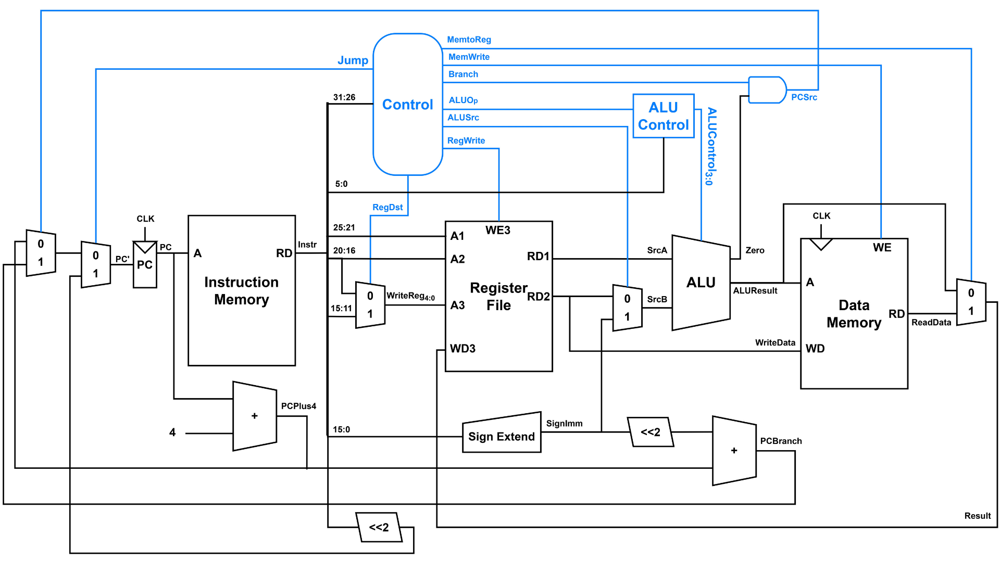

# Microprocessor without Interlocked Pipeline Stages (MIPS)

Proyek ini mensimulasikan **MIPS** menggunakan bahasa _verilog_ dengan referensi _Digital Design and Computer Architecture 2nd Edition_ oleh **David Money Harris** and **Sarah L. Harris**

## **🔗 Lihat [Rangkuman Arsitektur Prosesor MIPS](https://docs.google.com/document/d/1pAXqmZG_dCCwxrkT2Vopft7MBVUdl0mRUUSVTXJz1RQ/edit?usp=sharing) untuk detail dokumentasi**

## 🛠️ Daftar Pembuat
| Nama                        | NIM                |  
|-----------------------------|--------------------|
| Achmad Muhajir              | 22/500339/TK/54838 |
| Avicena Taufik Nur Karim    | 20/460169/TK/50758 |
| Jonatan Riverino Nugroho    | 22/493272/TK/54027 |
| Kyla Lavinia Aisha Suryanto | 22/492901/TK/53961 |
| Laila Nur Rizqi Tasnimiyah  | 22/493690/TK/54095 |
| Muhammmad Shafa Adhitiya    | 22/496402/TK/54378 |
| Ricky Tanuwijaya            | 21/477506/TK/52592 |
| Shofi Na'ila Haniefah       | 22/502927/TK/54923 |

## 📦 Dependencies
- [Icarus Verilog](http://iverilog.icarus.com/) (`iverilog`, `vvp`)
- [GTKWave](http://gtkwave.sourceforge.net/) _(opsional untuk melihat gelombang sinyal)_

## 📘 User Manual
1. pastikan anda punya **Icarus Verilog** ter-install di komputer 💻 anda
2. **download** 📥 semua file 📄 dari github ini, lalu **unzip** 📚
3. buka folder 📁 `testbench` (./MIPS/testbench) lalu, klik kanan, dan **run cmd/terminal** 💻 (atau buka cmd/terminal lalu, masukan perintah ini: `cd ./MIPS/testbench`)
4. masukkan list perintah ⌨️ sebagai berikut pada **cmd/terminal** untuk generate file testbench:
- `iverilog -I.. -o alu_tb alu_tb.v`
- `iverilog -o control_tb control_tb.v`
- `iverilog -o dataMem_tb dataMem.v`
- `iverilog -o insMem_tb insMem.v`
- `iverilog -o regsFile_tb regsFile_tb.v`
5. lalu lakukan testbench 1 per 1 dengan run perintah berikut:
- `vvp alu_tb`
- `vvp control_tb`
- `vvp dataMem_tb`
- `vvp insMem_tb`
- `vvp regsFile_tb`
6. ✅ pastikan semua testbench berjalan dengan benar sesuai testbench pada [Rangkuman Arsitektur Prosesor MIPS](https://docs.google.com/document/d/1pAXqmZG_dCCwxrkT2Vopft7MBVUdl0mRUUSVTXJz1RQ/edit?usp=sharing)
7. ✅ file siap digunakan
